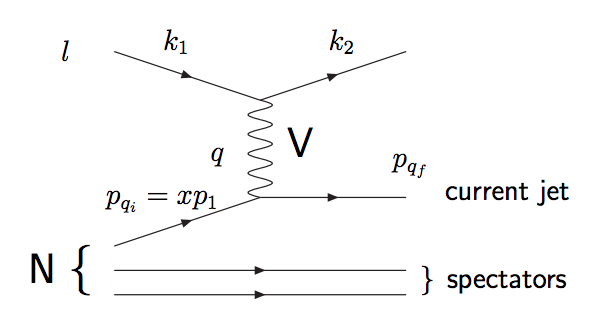

# 散乱

- https://mstwpdf.hepforge.org/plots/plots.html

## 深非弾性散乱

- 非弾性散乱
    - 入射粒子と終状態の粒子が異なる反応、入射粒子のエネルギーが失われる反応：inelastic scattering
- 弾性散乱
    - 入射粒子と終状態の粒子が同一の反応：elastic scattering
    - 「Elastic」とは入射粒子のエネルギーが粒子を生成するために使用されない反応を指す

この非弾性散乱のうち、ハドロンに超高エネルギーレプトン（短い波長のprobe）を打ち込むことで内部を破壊的に調査する手法を指す。
HERA実験などが代表的な実験である。

