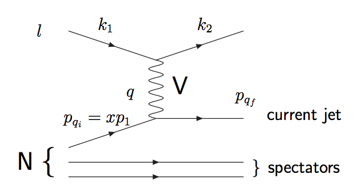

# 散乱
## はじめに
- https://mstwpdf.hepforge.org/plots/plots.html

- 非弾性散乱
    - 入射粒子と終状態の粒子が異なる反応、入射粒子のエネルギーが失われる反応：inelastic scattering
- 弾性散乱
    - 入射粒子と終状態の粒子が同一の反応：elastic scattering
    - 「Elastic」とは入射粒子のエネルギーが粒子を生成するために使用されない反応を指す

この非弾性散乱のうち、ハドロンに超高エネルギーレプトン（短い波長のprobe）を打ち込むことで内部を破壊的に調査する手法を指す。
HERA実験などが代表的な実験である。

## 深非弾性散乱
原子核Nにレプトンをぶつける深非弾性散乱を下図に示す。

入射粒子は4元運動量$$k_1$$を持ち、ベクトルボソン$$V=Z,E,\gamma$$を交換し4元運動量$$k_2$$となって逃げていく。
原子核（例えば陽子）内部のパートンが反応に寄与するため、実際の運動量はブヨルケン変数$$x$$を用いて$$xp_1$$と表すことができる。
ここで運動量移行（momentum transferは

$$
q^2 = (k_1 - k_2)^2
$$

として定義される。Q-valueは

$$
Q^2 = -q^2
$$

として定義される。

- $$Q^2>1~\rm{GeV}^2$$
- 終状態のハドロン系の不変質量が4GeVを超える

この2条件を満たす非弾性散乱を、特に深非弾性散乱と呼ぶ。

### ブヨルケン変数
ローレンツ不変な運動学的変数で、各自然体の運動量に対するパートンが持つ運動量の割合として解釈される。
0から1の間を取るものである。深非弾性散乱は本来は散乱なので、それを表すパラメーターとして散乱角と運動量移行が用いられるが、それを変換してブヨルケン変数$$x$$と$$Q^2$$で表した形式を用いることが一般的。

### 構造関数(Structure function)
陽子が点状ではなく、内部構造を持っていることを反映する。

