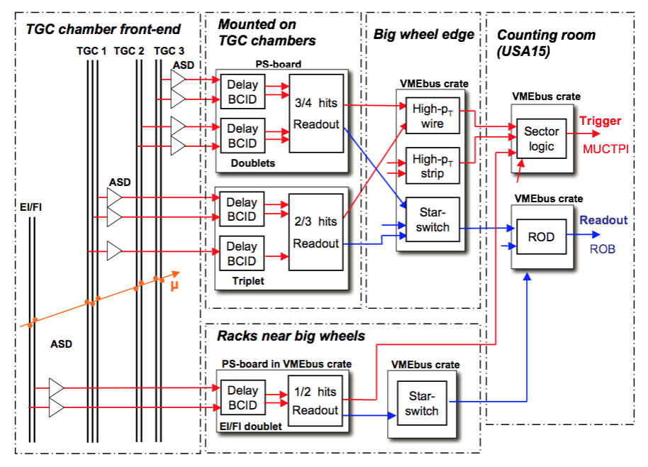

# ミューオントリガー (endcap)
## TGC　Level-1 muonトリガー
TGC検出器は $1.05 < \eta < 2.40$ をカバーしている。TGC M1は $\eta<2.7$まで覆っている。

### 読み出し単位
TGC検出器はさらに $\eta$ の範囲で

- $1.05<\eta<1.9$:end-cap領域
- $\eta<2.4$: forward領域

で分かれている。

1台のSLボードは2トリガーセクターを読み出しており、片サイド $74$ トリガーセクター=36枚のSLボードが担当している。

- エンドキャップ領域：48トリガーセクター
- フォーワード領域：24トリガーセクター

### コインシデンスロジック
TGC検出器から読み出されたパスは2種類ある。M1と（M2+M3）で個別にコインシデンスを取り、最終的にそれらを
まとめてTGC検出器のトリガー発行とする。
以下に概要図を示す。

#### TGC M1コインシデンス
PSボードで 3-out-of-2コインシデンス（要するに3層中2層にヒットがあればコインシデンス通過）を要求する。
通過した情報はHigh-pTボードへ送られる。

#### TGC M2&M3コインシデンス
PSボードで 3-out-of-4コインシデンス（要するに4合わせて4層中3層にヒットがあればコインシデンス通過）を要求する。
通過した情報はHigh-pTボードへ送られる。

### RoI
### トリガーロジック
TGC検出器は3枚（衝突点に近い方からM1、M2、M3）あり、内部で3層、2層、2層の最大7層構造になっている。
シンプルな考え方であれば、本物のミューオンは衝突点から検出器を貫くので、7層にヒットがある事象に対してトリガーを発行する。
しかし実際は検出器の検出効率も考慮に入れる必要があり、ミューオンが通過しても検出器にヒット情報が残らない場合がある。
そのため7層ヒットを要求すると本物のミューオンも落ちてしまうため、より複雑にコインシデンスロジックを考えていく必要がある。

### 背景事象
考えられる背景事象の一つに、陽子がビームパイプを叩き発生する荷電粒子が磁場によって曲げられてTGC検出器にヒットを残してしまう場合である。
もしくは宇宙船ミューオンで、地下100mに検出器が置かれているものの上空からミューオンが降り注いでいる。

- Cavern background
  - Background hits in the muon spectrometer arise primarily from low energy photons and neutrons. They are generated by synchronous proton collisions with the bunch crossing that triggers the ATLAS data-taking mechanism (in-time background), or by collisions that happen one to several bunch crossings earlier (out-of-time background). The resulting particles are generically referred to as ‘cavern background’.  

# Level-1 -> MuCTPi
トラック候補を4つ送る
1つにつきRoIの番号、pT閾値の値、電荷、トラックの質の情報を格納してGTXで送る。

# HLT
ミューオントリガーのHLT
- MuonSA
- muComb
- EventFilter

で構成されている

## MuonSA
ミューオン検出器の情報だけ使う。
TGC,RPC,MDT,CSC
pTの算出にはLook-Up-Tableが用いられる。角度α、βから瞬時に求める。
事前にオフラインミューオンを使って関係式がもとめられている。

L1から貰うRoI付近のTGC(RPC)のヒットを読み出す
そのヒットから各ステーションにおけるミューオンの飛跡を概算する（TGCによるロード）
そのロードを使ってMDTヒットを選択する。ロードの中心とMDTのヒットの距離（residual）を計算して、ある値以下のものを選択してスーパーポイントを計算する
得られたスーパーポイントからα、βを計算してLook-Up-tablleから各パラメータに対応するpTを計算する

## muComb
MuonSAでの飛跡を内部飛跡検出器の位置まで外挿する。
外挿してその周辺を（決められた範囲で）探索して対応の取れた飛跡を取得する。そしてMuonSAとの重み付き平均に酔ってmuCombでのpTを計算する。

## EventFilter
全検出器の情報を使用して、より精密に飛跡の再構成を行う

【バクグラウンド】
カロリメータから漏れ出してきたパイオン
環境backgroundのフォトンによって散乱された電子
中性子によって反跳された陽子

## ivarmedium
## タグ & プローブ

## Inefficiency
### Hot-RoI
磁場が弱い領域がありミューオンが十分に曲がってくれない領域がある。
そこではそも 　

# 疑問を考えてみよう
## なんでL1MU20で20 GeVが重要なのか
トリガーの閾値は低い方が物理アクセプタンスを削ることが無いので有利なはず。2015年Run-2はじめはMU15で頑張っていた（LHC加速器がしょぼかった為）。2016年移行はLHCが頑張ってきたので20 GeVへ上げた。
また閾値は上げすぎると、W→μμ（80 GeV）への感度を損なってしまうからで、40GeVにピークをもったミューオンを捉えるためにはそれより低い運動量からデータ記録してないといけない。
さらに、閾値を上げてもトリガーレートはそこまで下がりきらないから。。。
