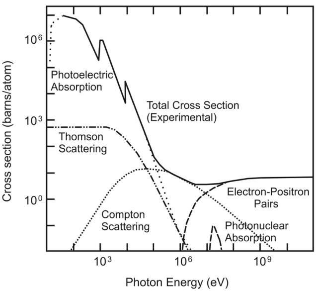

# Reference
- http://pdg.lbl.gov/2020/2020/reviews/rpp2020-rev-passage-particles-matter.pdf

# 重粒子によるエネルギー損失
## 運動量と断面積

## stopping power

* 変数について
    * $$\rho$$：標的物質の密度
    * $$\beta=v/c$$：粒子の速度
    * $$D \simeq 0.3071$$：定数
    * $$Z$$：標的物質の原子番号
    * $$A$$：標的の質量数
    * $$z$$：電荷

平均エネルギー損失（$$<dE/dx>$$）はBethe-Blochの式で記述される。

$$
\frac{1}{\rho} \frac{dE}{dx} = D\frac{Z}{A}z^2\frac{1}{\beta^2} \left( \ln \left[ \frac{2mc^2\beta^2}{I(1-\beta^2)}\right] -\beta^2 - \frac{\delta}{2}\right)
$$

この式は$$0.1<\beta\gamma<1000$$の領域で有効。標的のZが大きいほど、エネルギー損失は大きくなる。
図のBethe領域に注目。初めは$$1/\beta^2$$によって$$<-dE/dx>$$がどんどん小さくなっていく。
それに反して対数の項は大きくなっていくため、$$-\frac{dE}{dx}$$がある程度の所で極小値を取る。
この領域に該当するエネルギーで通過する粒子（ミューオン）はMinimized Particle（MIP; みっぷ）と呼ばれる。
それ以上になると他の項の影響が大きくなってきて$$-\frac{dE}{dx}$$の値が大きくなっていく。

## エネルギー損失（low-energy）
## $$\delta-rays$$
## エネルギー損失のふらつき
## multiple-scattering

# photon and electron interactions in matter 
## エネルギー損失
## Radiation length
## bremsstrahlung enery loss
## Critical energy
## Energy loss by photons
## Bremsstrahlung and pair production at very high energies
## Photonuclear and electronuclear interactions at still higher energies
# Electromagnetic cascades
# Cherenkov and transition radiation

# 荷電粒子の振る舞い

荷電粒子が物質中を通過する際、原子核に束縛された電子と電磁相互作用を起こしながら通過していく。

## Photon interaction with materials

エネルギーが上がっていくに従って、支配的な反応が変わっていく。

* 光電効果
* レイリー散乱
    * $$\gamma$$ 電子と弾性散乱を起こす。
* コンプトン散乱
    * $$\gamma$$ が原子核の電子と非弾性散乱を起こす。
* 対生成
    * $$\gamma$$ が電子や原子核と反応して、電子陽電子対を生成する。
    * 図から分かるように、最低でも1MeV以上のエネルギーが必要となる。

## Bethe-Blochの式
荷電粒子が物質中で失うエネルギーは、量子力学の補正を取り入れたBethe-Blochの式で表される。

* 粒子は
    * 速度が遅いと、よくエネルギーを落とす
    * 標的物質の原子番号が大きいと、よくエネルギーを落とせる
    * 標的物質の電荷が大きいと、よくエネルギーを落とせる

## ハドロニックシャワー
