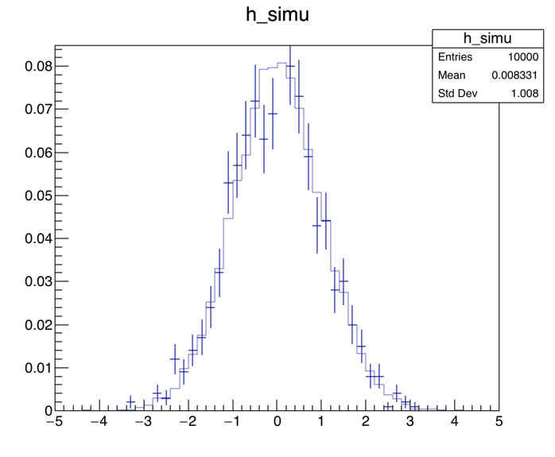
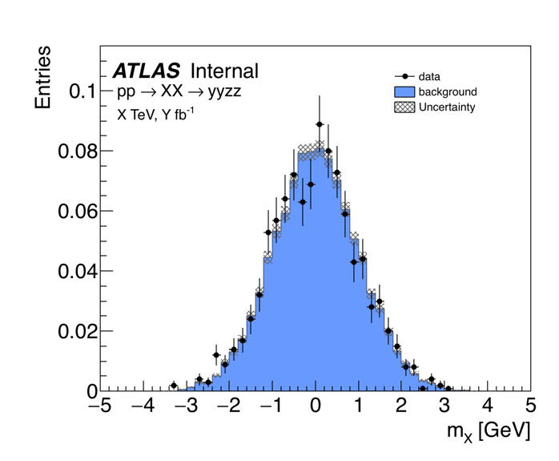
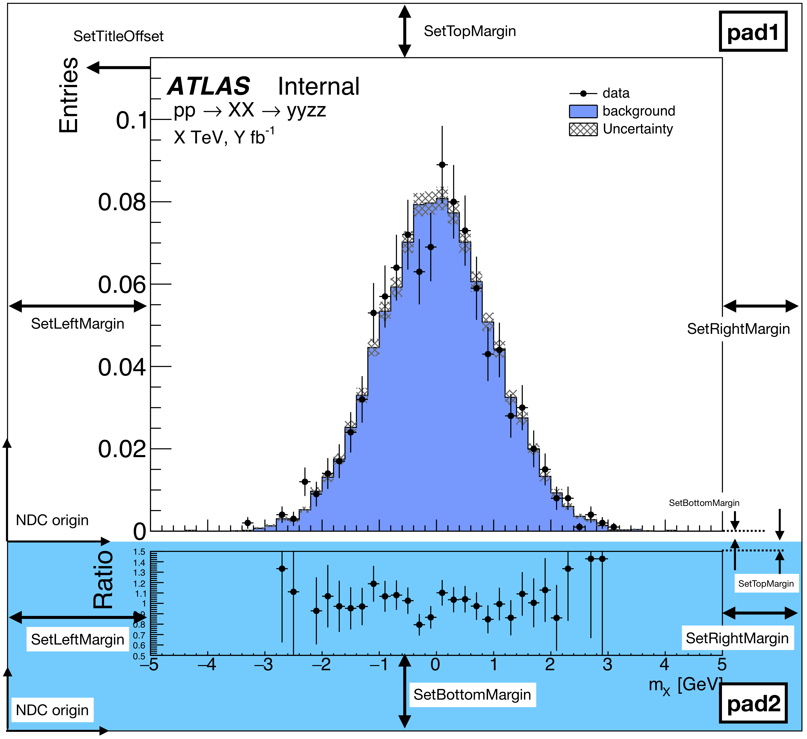

# CERN ROOT の使い方
C++かPythonのどちらかを使うことで、CERNが提供するお絵かきライブラリROOTを使用することができます。
高エネ実験でよく使用される実験データ・フォーマットはROOT形式だと思いますので、ROOTでの描画テクニックは至る所で必要になってくると思います。
ここでは必要最低限の描画テクニックをまとめて、たかがお絵かきに時間を掛けない研究ライフを送ることを目的とします。

## 見栄えを整える
見栄えを整える前（左）と、整えた後（右）。
ガウシアンで背景事象と実験値に見立てたデータを擬似的に生成、論文でよく見るような決めプロットみたいにするためのテクニックをまとめます。




何かと便利なので普段はPyROOTを使っています（解析は実行速度が欲しいのでC++で行って、描画はPythonでという形）。
なので以下に出てくる例は全てPythonスクリプトによるもので、

```python
import ROOT as R
```

を設定していることを前提としています。

- [統計Boxを消す](#統計boxを消す)
- [マージンの調整](#マージン余白を調整する)
- [x軸、y軸のタイトルを調整する](#x軸y軸のタイトルを調整する)
- [x軸、y軸のラベルを調整する](#x軸y軸のラベルを調整する)
- [ヒストグラムの見栄え](#ヒストグラムの見栄え)
- [エラーをメッシュで表示する](#エラーをメッシュで表示する)
- [実験値をポイントで書く](#実験値をポイントで書く)
- [ATLASラベルを書く（TLatex）](#atlasラベルを書くtlatex)
- [レジェンドを書く（TLegend）](#レジェンドを書くtlegend)

### 統計Boxを消す

```python
R.gStyle.SetOptStat(0)
```

### マージン（余白）を調整する

```python
R.gPad.SetTopMargin(0.1);     # TPadとキャンバスの上側の余白
R.gPad.SetBottomMargin(0.15); # TPadとキャンバスの下側の余白
R.gPad.SetRightMargin(0.05);  # TPadとキャンバスの右側の余白
R.gPad.SetLeftMargin(0.18);   # TPadとキャンバスの左側の余白
```

左側にはy軸目盛りと軸タイトルがあるので、多めに余白を設定しています。逆に右側は何もないので、良い具合に狭めの余白を設定しています。

### x軸、y軸のタイトルを調整する

```python
# ヒストグラムのタイトル
h_simu.SetTitle("")

# x軸のタイトル
h_simu.GetXaxis().SetTitle("m_{X} [GeV]")
h_simu.GetXaxis().SetTitleSize(0.05)
h_simu.GetXaxis().SetTitleOffset(1.1)

# y軸のタイトル
h_simu.GetYaxis().SetTitle("Entries")
h_simu.GetYaxis().SetTitleSize(0.05)
h_simu.GetYaxis().SetTitleOffset(1.3)
```

ヒストグラムのタイトル、軸タイトルはもちろんコンストラクタで設定することができますが、
細かく色々したくなることも考えると個別に設定する方法も知っておく必要があると思います。

###  x軸、y軸のラベルを調整する

```python
h_simu.GetXaxis().SetLabelSize(0.05)
h_simu.GetYaxis().SetLabelSize(0.05)
```

ラベル（目盛り）のテキストの大きさを設定しています。
「目盛りを大きくしろ」と言われたら、適度に設定しましょう。

### ヒストグラムの見栄え

```python
h_simu.SetLineColor(R.kBlack)
h_simu.SetFillColor(R.kAzure-4)
```

### エラーをメッシュで表示する

```python
h_error = h_simu.Clone()
h_error.SetFillStyle(3244)
h_error.SetFillColor(R.kGray+2)
h_error.SetMarkerStyle(8)
h_error.SetMarkerSize(0)
h_error.Draw("same e2")
```

今回は青色のヒストグラムを背景事象に見立てて描画しており、その統計誤差を表示する際にメッシュで表示することが多々あります。
その際には統計誤差を付けたいヒストグラムをCloneで持ってきて、上の様な処理を行うことで重ねて表示することができます。

### 実験値をポイントで書く

```python
h_data.SetLineColor(R.kBlack)
h_data.SetMarkerStyle(8)
h_data.SetMarkerSize(0.8)
h_data.Draw("same p")
```

実験値は往々にして黒点＋誤差棒で表記されます。

### ATLASラベルを書く（TLatex）
（思いっきり実験名出していますが...）
ROOTでは通常の汎用を書くためのTLegendクラスと、文字や数式を書くためのTLatexクラスが用意されています。
そして微妙に使い方が異なります。ここではまず、TPad内に文字を書くTLatexクラスについて説明します。
個人的なキモはSetNDC(1)を書いている所で、Normalised Coordinate（NDC）で位置を指定しています。

```python
latex = R.TLatex()
latex.SetNDC(1)
latex.SetTextFont(72)
latex.DrawLatex(0.2, 0.83, "ATLAS")
latex.SetTextFont(42)
latex.DrawLatex(0.34, 0.83 , "Internal")
latex.SetTextSize(0.04)
latex.DrawLatex(0.21, 0.79, "pp #rightarrow XX #rightarrow yyzz")
latex.SetTextSize(0.035)
latex.DrawLatex(0.21, 0.74 , "X TeV, Y fb^{-1}")
```

### レジェンドを書く（TLegend）

```python
# 位置
legend = R.TLegend(0.7, 0.75, 0.9, 0.85)

# 見栄え
legend.SetBorderSize(0) # 凡例を囲む線をなくす（デフォルトで黒線で囲まれている）
legend.SetFillStyle(0)  # 凡例の領域の背景色を無くす（デフォルトで白塗りされている）

# 凡例を追加する
legend.AddEntry(h_data,  "data", "pl")       # p: ポイント、l:ライン
legend.AddEntry(h_simu,  "background", "f")  # f: boxで囲む
legend.AddEntry(h_error, "Uncertainty", "f")

# 描画する
legend.Draw()
```

## キャンバスを二分割する
よくあるプロットの2例目として、通常のヒストグラムとそれらのRaitoを取ったプロットを書く場合がある。
TPadを駆使することで、よくある図もお絵描きすることができる。




### TPadの使い方
まず大元となるTCanvasを定義し、その上にヒストグラムを配置するためのTPadを定義していく。
TPadは下に示すように「どこに、どの大きさで」を手動で定義することができる（pad1、pad2は図中の説明文と対応している）。

```python
# TPad("","", x_low, y_low, x_up, y_up)
pad1 = R.TPad("pad1", "pad1", 0, 0.26, 1., 1.)
pad2 = R.TPad("pad2", "pad2", 0, 0.  , 1., 0.26, R.kAzure+10)
```

引数で指定する4つの数字は、TCanvas左下を(0,0)、右上を(1,1)に持つ座標系の値です。
pad2がどの領域かわかりやすいように第7引数で色を付けています。
定義したTPad毎に図に示している余白を適宜設定することで、丁度よい感じに（好きなように）プロット領域の見栄えを整えます。

```python
pad1.SetBottomMargin(0.02)
pad1.SetLeftMargin(0.18)  
pad1.Draw()

pad2.SetTopMargin(0.05) 
pad2.SetBottomMargin(0.4)
pad2.SetLeftMargin(0.18)  
pad2.Draw()
```

この余白は適宜、ファイルに出力して微調整を行うのが一番何も考えず楽です。
以上でTPadの設定が終わったら、あとは普通にプロットを書いていくだけです。一つ気をつけることがあるとすれば、TPadの移動を明示的にしておくことで、バグが潜みにくくなるということくらいです。

```python
pad1.cd()
# pad1にDrawしたいヒストグラムを定義、Drawする

pad2.cd()
# pad2にDrawしたいヒストグラムを定義、Drawする
```

