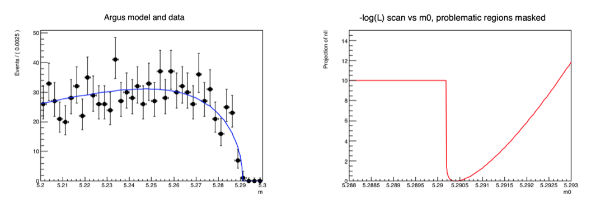

# RooStats 

## Tutorial

```cpp
void rf606_nllerrorhandling()
{
   // Observable
   RooRealVar m("m", "m", 5.20, 5.30);

   // Parameters
   RooRealVar m0("m0", "m0", 5.291, 5.20, 5.30);
   RooRealVar k("k", "k", -30, -50, -10);

   // Pdf
   RooArgusBG argus("argus", "argus", m, m0, k); 

   // Sample 1000 events in m from argus
   RooDataSet *data = argus.generate(m, 1000);


   RooPlot *frame1 = m.frame(Bins(40), Title("Argus model and data"));
   data->plotOn(frame1);
   argus.plotOn(frame1);
   argus.fitTo(*data, PrintEvalErrors(10));

   m0.setError(0.1);
   argus.fitTo(*data, PrintEvalErrors(0), EvalErrorWall(kFALSE));

   // Construct likelihood function of model and data
   RooNLLVar nll("nll", "nll", argus, *data);

   RooPlot *frame2 = m0.frame(Range(5.288, 5.293), Title("-log(L) scan vs m0, problematic regions masked"));
   nll.plotOn(frame2, PrintEvalErrors(-1), ShiftToZero(), EvalErrorValue(nll.getVal() + 10), LineColor(kRed));
   frame2->SetMaximum(15);
   frame2->SetMinimum(0);

   TCanvas *c = new TCanvas("rf606_nllerrorhandling", "rf606_nllerrorhandling", 1200, 400);
   c->Divide(2);
   c->cd(1);
   gPad->SetLeftMargin(0.15);
   frame1->GetYaxis()->SetTitleOffset(1.4);
   frame1->Draw();
   c->cd(2);
   gPad->SetLeftMargin(0.15);
   frame2->GetYaxis()->SetTitleOffset(1.4);
   frame2->Draw();
}
```


