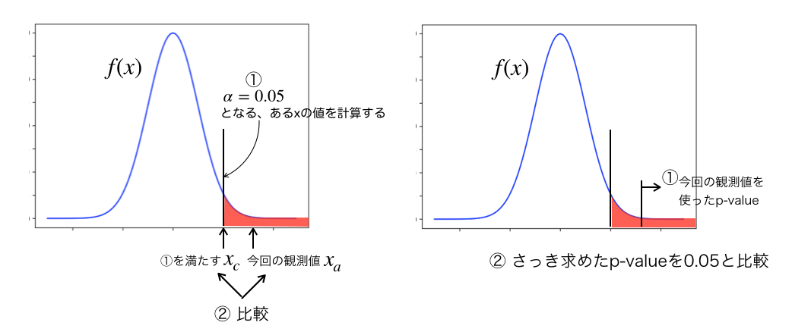

# 統計処理の基礎
## p-value

p-valueは次式で定義される。

$$
p=\int_{q_{\mu,\rm{obs}}}^{\infty}~f(q_{\mu}|\mu)~dq_{\mu}
$$

ここで $f(x)$ は仮説 $H_0$ の確率密度関数を表しており、p-valueが小さいことは観測値が $H_0$ の範囲では滅多に起きない事象であることを示している。

- eveidence : p-value=0.003
- discovery  : p-value=0.000003

## 仮説検定（Hypothesis test）
仮説検定とはnull hypothesis (帰無仮説) $H_0$ を立てて、その仮説の元で観測値が得られる確率を考え、説の棄却を行うものである。
（高エネルギーでは片側検定を多用するので、以下の説明では全て片側検定であることを念頭に置いている）。
まず有意水準 $\alpha$ を設定する。よく用いられる有意水準は0.05である。
この $\alpha=$ p-valueが0.05となるような領域を計算し、これを棄却領域と呼ぶ。
観測値 $x$ がこの棄却領域に含まれれば、

- null hypothesisでこの$$x$$が得られる確率は5%以下である

ことが言え、この時には「これは滅多に起こらないものであり、$$H_0$$はどうやら正しくない」＝棄却、を行うというロジックである。

上記の手順では

- $\alpha$ を設定する
- $\alpha=0.05$ となるような領域を設定する
- 観測値 $x$ がその領域に含まれるかどうかを計算する

という3段階に作業が分けられていた。
そうではなく、単に観測値で求めた $p-value$ と $\alpha=0.05$ を比較すれば次の事が言え、

- $x_p>0.05$ ：棄却領域（critical region）に観測値は含まれない
- $x_p<0.05$ ：棄却領域（critical region）に観測値は含まれるため、$$H_0$$は棄却される

と考えればよく、単にp-valueを（何も考えず）計算すれば棄却かどうかが判定できるわけである。
この考えをより一般化すると

- null hypothesisを立てる
- （計算しやすい・評価しやすい）test statisticsを準備する
- p-valueを計算する
- 設定した値と比較して小さければ null hypothesisの棄却

となる。
ここで注意しておかなければならないのは、Frequentistの観点ではp-valueはnull hypothesisとどれだけ一致しているか（もしくは乖離しているか）を測る指標である以上の意味を持たないということである。
例えば「SM onlyの分布から5 $\sigma$ のズレを観測」が直ちに「ヒッグス粒子の発見」という文言に結びつくわけではないということである。
以下ではこれらをより高エネ界隈で使われている言葉に直して説明していこう。

## ネイマン・ピアソンの補題（Neyman-pearson lemma）

$$
\lambda(x) = \frac{f(x|H_1}{f(x|H_0)}
$$

の尤度比（likelihood ratio）を使う検定手法が最も識別能力が良いとする。

## test statistics
統計処理の大きな主題の一つは何で評価するか、つまりtest statistics($$q$$, $$\lambda$$)をどう選ぶかである。

### Likelihood ratio
$$
\lambda = \frac{L(\theta, \hat{\mu})}{L(\hat{\theta}, \hat{\mu})}
$$

# Asymptotic formulae
検定量として尤度比（likelihood ratio）を使う。

||||
|:--:|:---|:--:|
|$t_{\mu}$|$-2\ln\lambda(\mu)$||
|$q_{\mu}$|||
|$q_{0}$|$-2\ln\lambda(0)$|$\hat{\mu}>0$|
||0|$\hat{\mu}<0$|
|$q_{\mu}$|$-2\ln\lambda(\mu)$|$\hat{\mu}<\mu$|
||0|$\hat{\mu}>\mu$|

## profile likelihood ratio

$$
-2\ln\lambda(\mu) = \frac{(\mu-\hat{\mu})^2}{\sigma^2} + \mathcal{O}(1/\sqrt{N})
$$

$\hat{\mu}$ は 平均値 $\mu'$、分散 $\sigma$ のガウス分布に従う。また $N$ はサンプルサイズを表している。
