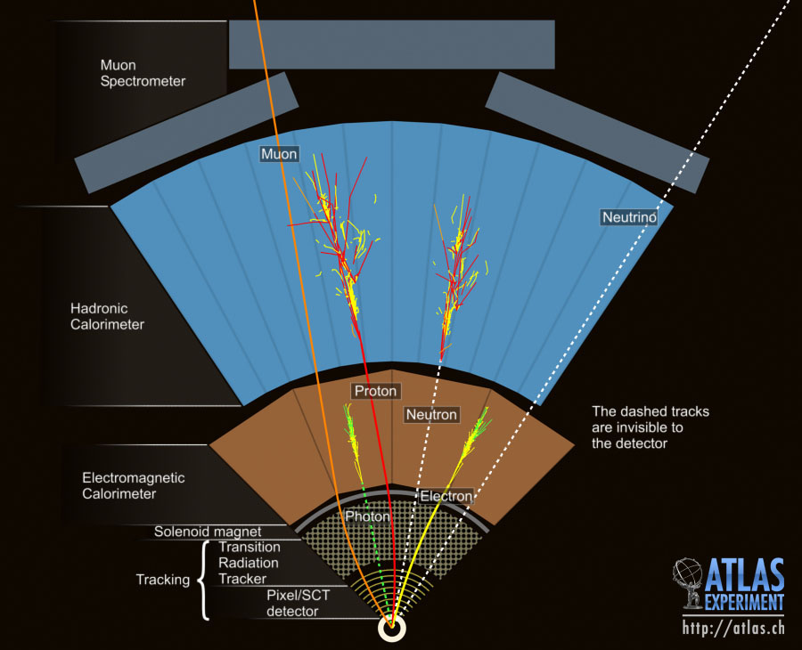
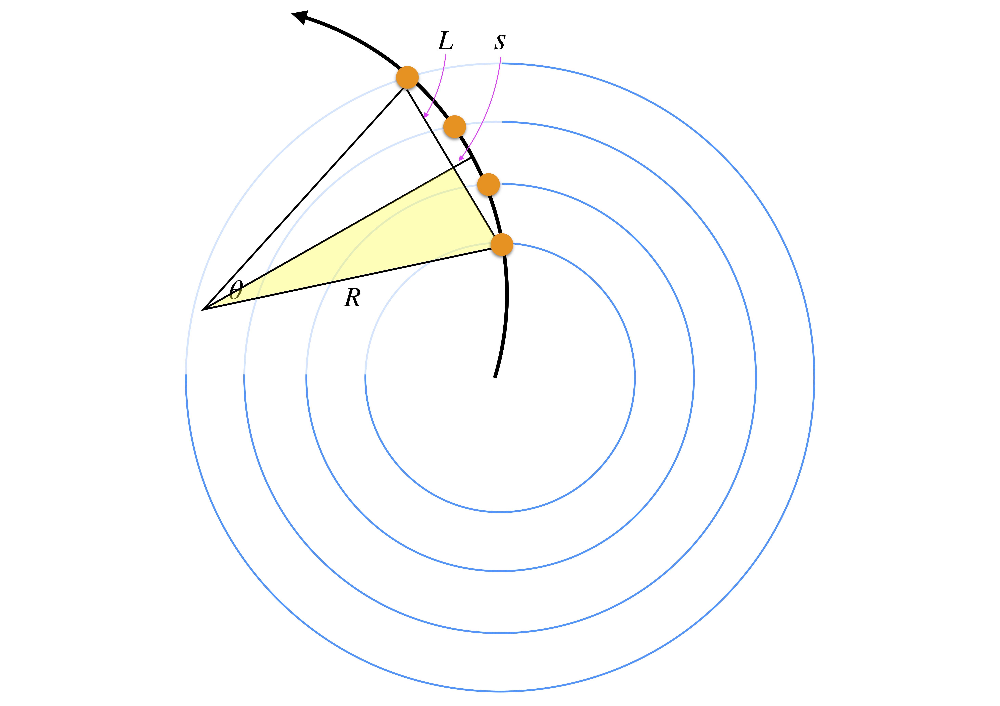
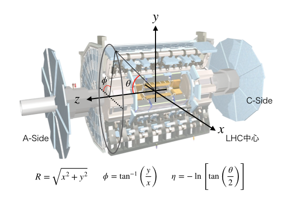

# ATLAS実験
## なぜ？

- 陽子・陽子衝突なのはなぜか？

## 検出原理

ATLAS実験で検出できる粒子は

- 電子
- ミューオン
- 光子
- 中性子
- ハドロンジェット

の5種類である。これらを、検出器の配置と特性を活かして識別する必要がある。

## 特徴的な2種類の磁石
ATLAS検出器では2種類の磁石を用いて、荷電粒子の運動量測定を行っている。内部秘跡検出器のためのソレノイド磁場と、ミューオン検出位のためのトロイダル磁場について説明する。

### ソレノイド磁石
ソレノイド磁石は直径2.4mの大きさで、内部秘跡検出器を包み込むように設置されている。
そのため内部秘跡検出器（以下ID）では、その磁場を用いて荷電粒子の運動量を測定することができる。

荷電粒子の磁場中の運動は、

$$
\frac{mv^2}{R} = evB \\
\Leftrightarrow mv = eBR \\
\Leftrightarrow p = eBR \\
\Leftrightarrow p = 0.3BR \\
$$

そのため、軌道の半径 $$R$$が分かれば粒子の運動量を求めることができる。
最後の変形では、次の関係式を用いた。

$$
\alpha = \frac{e^2}{4\pi} = \frac{1}{137} \\
\Leftrightarrow e \simeq 0.3
$$

さらに近似手法を用いることでより実験的に測定のしやすい関係式を導出する。図中の黄色の直角三角形に着目して三平方の定理より、

$$
R^2 = (R-s)^2 + \left( \frac{L}{2} \right)^2 \\
\Leftrightarrow R^2 = R^2 - 2Rs + s^2 + \frac{L^2}{4} \\
\Leftrightarrow R = \frac{s}{2} + \frac{L^2}{8s} 
$$

ここで、実際の軌道では$$s << L$$が成り立つので

$$
R \simeq \frac{L^2}{8s} 
$$

この曲率半径を用いることで、最初に導入した式を変形することができ、

$$
p = eBR = \frac{eBL^2}{8s} = \frac{0.3BL^2}{8s}
$$

ここから運動量を求めることができる。
事前の実験セットアップから磁場$$B$$は知っているはずなので、サジッタ$$s$$と距離$$L$$を求めることができれば運動量を算出することができる。
以上の導出からも、荷電粒子の運動量を測定するには飛跡検出器に磁場をかけて置かなければならないことが理解できる。

### トロイダル磁石
ATLAS検出器に特徴的な磁場は、このトロイダル磁場です。
ミューオンの軌道を$$R$$方向へ曲げることで、ミューオン検出器が運動量を測定できるようにしている。

## 内部秘跡検出器
### IBL
### Pixel
### SCT
### TRT
## カロリメーター
粒子のエネルギーを測定する。
→ bremsstrahlung を起こしてエネルギーを落とす +$$\gamma$$ を放出する
Definition: 
The radiation length of a material is the mean length (in cm) to reduce the energy of an electron by the factor 1/e.   

Physical explanation: 
An electron arriving in the vicinity of an atom will be affected by the electromagnetic field produced by the electrons of this atom. Because of this interaction, the electron will emit photons which will reduce its energy. This is called the Bremsstrahlung radiation. It is clear that this interaction will depend on the number of electrons of the atom (atomic number Z) but also the size of the atom, represented by its atomic weight A.  

### 電磁カロリメーター
入射粒子は物質中の核子と電磁相互作用をして軌道を曲げられる。
電子、光子を放出させて電磁シャワーを観測する。
基本的に入射粒子のエネルギーが大きいほど、測定誤差は小さくなる。

[ターゲット]
* $$e$$
    * 核子による電磁相互作用で軌道を曲げて制動放射（Bremsstrahlung）を起こし、測定する
* $$\gamma$$
    * 核子との相互作用で対生成を起こさせて、電子の生成
    * 生成された電子が制動放射で#gammaを放出。。。を繰り返し（カスケードシャワーを発生させて）検知する

[Key point]
* $$X_0$$：Radiation length、放射長
    * 入射粒子のエネルギーが 1/e （〜超ざっくり半分）になる距離
    * 半分、と考えるとX0は各反応点から反応点までの距離に相当
* $$E_C$$：Critical energy
    * 電子が$$\gamma$$を放出し始めるエネルギー。
    * 入射高エネルギー粒子のエネルギーが$$E_C$$になるまでシャワー生成が続く（それを下回ると生成が終わる）
* RM：Moliere radius 
    * 横方向（transverse）シャワーサイズ。

$$
\frac{\sigma(E_0)}{E_0} = \frac{a}{\sqrt{E_0}} \oplus \frac{b}{E_0} \oplus c
$$

* a：stocastic term
    * 統計的なゆらぎによる誤差（サンプリングカロリメーターだと、aが大きい）
* b：noise term
    * ノイズ・パイルアップ
* c：constant term
    * 物質の不均一性、キャリブレーションの精度、shower の漏れ (leakage)

* カロリメーターは
    * 入射粒子のエネルギーが大きいほど、分解能がよくなる

### ハドロンカロリメーター
ハドロンシャワーを起こさせてエネルギーを測定する。 入射ハドロンが核と反応を起こす (QCD反応, 核をぶっ壊す)

* Elastic scattering: h+nucleus -> h + nucleus
* Inelastic scattering: h+nucleus -> π+ + π- + πο + ...+ nucleus
* Absorption and capture
* Secondary hadrons and muons in the shower
* Secondary neutrinos (not detectable) 

## ミューオン検出器

# ルミノシティ
単位面積当たり単位時間あたりの衝突に寄与する粒子の個数を表し（$$m^{-2}s^{-1}$$）、次式で定義される。
基本的にルミノシティは大きいほどhappyな物理量です（実験環境によりけりですが）。

$$
L = \frac{nfN_1N_2}{4\pi\sigma_x\sigma_y}
$$

- バンチ数に比例する
- 交叉頻度$$f$$は大きいほど良い
- 各バンチに含まれる粒子数（$$N_1$$ｍ$$N_2$$）は多いほど、ルミノシティは大きくなる。
- ビームを絞るほど（ビームの断面積$$\sigma$$を小さくするほど）ルミノシティは大きくなる

ルミノシティと単位時間あたりの生成事象数は次の関係にある（単位で考えてみると、より理解できるはず）。

$$
R = L \times \sigma
$$

ここまでのルミノシティは単位時間あたりのルミノシティ、つまり瞬間ルミノシティを意味していました。
ここでNは単位時間あたりに生成される粒子数、Lはルミノシティ、$$\sigma$$は粒子の生成断面積（=生成確率）を表しています。$$\sigma$$は既に決まっている物理量なので、実験的にはルミノシティのみが調整できるパラメーターです。そのため、ルミノシティを大きくすればするほど、生成断面積の非常に小さい稀事象を観測できる確率が上がるということです。
また既知の事象数も統計量が稼げるために、統計誤差の小さな測定が可能になるというメリットも当然あります。これらはHigh-Luminosity LHCのモチベーションになっています。

また、時間で積分した積分ルミノシティを導入することで、

$$
N =  L \times \sigma
$$

の様に、その実験稼働時間で期待できる粒子生成事象数を記述すこることができる。

# 座標系
ATLAS検出器が採用している座標系を次の図に示す。

# ラピデティ、擬ラピデティ
- https://arxiv.org/pdf/1010.2051.pdf

ローレンツ不変の断面積は次式で定義される。

$$
f(AB\to CX) \equiv E \frac{d^3\sigma}{d^3p} = E \frac{d^3\sigma}{\pidp_Ldp^2_T}
$$

# Reference

- https://cds.cern.ch/record/1457044/files/ATLAS%20fact%20sheet.pdf
