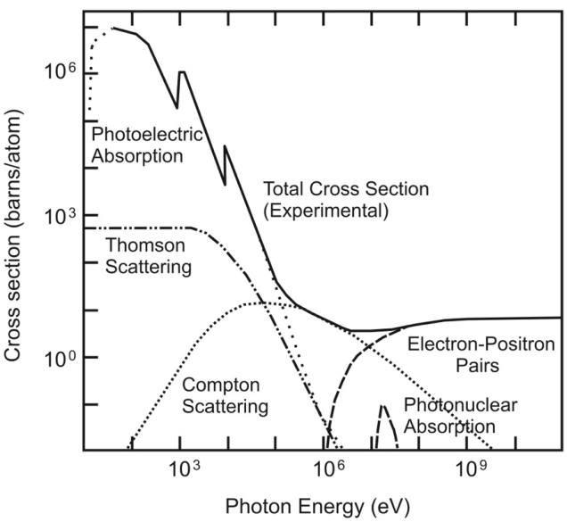

# 荷電粒子の振る舞い

エネルギーが上がっていくに従って、支配的な反応が変わっていく。光電効果＞コンプトン＞対生成
## ベーテブロッホ

$$
\frac{1}{\rho} \frac{dE}{dx} = D\frac{Z}{A}z^2\frac{1}{\beta^2} \left( \ln \left[ \frac{2mc^2\beta^2}{I(1-\beta^2)}\right] -\beta^2 - \frac{\delta}{2}\right)
$$

* 粒子の速度ベータの2乗に反比例
    * 速度が大きくなると、dE/dxは小さくなる（エネルギーを落とさない）
    * 速度が小さくなると、dE/dxが大きくなる（よくエネルギーを落とす）
* 電荷Z/Aに正比例

# HEP 検出器の基本
## 内部秘跡検出器
### IBL
### Pixel
### SCT
### TRT
## カロリメーター
粒子のエネルギーを測定する。
→ bremsstrahlung を起こしてエネルギーを落とす + γ を放出する
Definition: 
The radiation length of a material is the mean length (in cm) to reduce the energy of an electron by the factor 1/e.   

Physical explanation: 
An electron arriving in the vicinity of an atom will be affected by the electromagnetic field produced by the electrons of this atom. Because of this interaction, the electron will emit photons which will reduce its energy. This is called the Bremsstrahlung radiation. It is clear that this interaction will depend on the number of electrons of the atom (atomic number Z) but also the size of the atom, represented by its atomic weight A.  

### 電磁カロリメーター
入射粒子は物質中の核子と電磁相互作用をして軌道を曲げられる。
電子、光子を放出させて電磁シャワーを観測する。
基本的に入射粒子のエネルギーが大きいほど、測定誤差は小さくなる。

[ターゲット]
* e
    * 核子による電磁相互作用で軌道を曲げて制動放射（Bremsstrahlung）を起こし、測定する
* \gamma
    * 核子との相互作用で対生成を起こさせて、電子の生成
    * 生成された電子が制動放射で#gammaを放出。。。を繰り返し（カスケードシャワーを発生させて）検知する

[Key point]
* X0：Radiation length、入射粒子のエネルギーは
* 1/e （〜超ざっくり半分）になる距離
    * 半分、と考えるとX0は各反応点から反応点までの距離に相当

* EC：Critical energy
    * 電子がγを放出し始めるエネルギー。入射高エネルギー粒子のエネルギーがCになるまでシャワー生成が続く（それを下回ると生成が終わる）
* RM：Moliere radius 
    * 横方向（transverse）シャワーサイズ。

$$
\frac{\sigma(E_0)}{E_0} = \frac{a}{\sqrt{E_0}} \oplus \frac{b}{E_0} \oplus c
$$

* a：stocastic term、統計的なゆらぎによる誤差（サンプリングカロリメーターだと、aが大きい）
* b：noise term、ノイズ・パイルアップ
* c：constant term、物質の不均一性、キャリブレーションの精度、shower の漏れ (leakage)

### ハドロンカロリメーター
ハドロンシャワーを起こさせてエネルギーを測定する。 入射ハドロンが核と反応を起こす (QCD反応, 核をぶっ壊す)

* Elastic scattering: h+nucleus -> h + nucleus
* Inelastic scattering: h+nucleus -> π+ + π- + πο + ...+ nucleus
* Absorption and capture
* Secondary hadrons and muons in the shower
* Secondary neutrinos (not detectable) 

## ミューオン検出器

# Reference
* http://www.nucl.phys.titech.ac.jp/presen/data/thesis/b/ay2008/okamura/Bthesis.pdf
